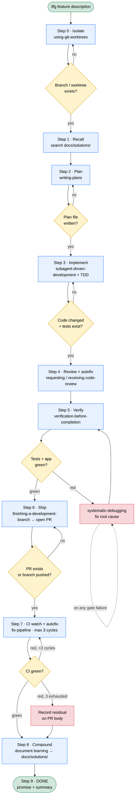

# LFG — Autonomous Engineering Autopilot (self-contained)

**Announce at start:** "I'm using the lfg skill to run this task hands-off, end to end."

## Overview

`/lfg [feature description]` runs an entire software task from idea to green CI to documented
learning **without stopping to ask the user anything**. It is the explicit opt-in autopilot.

**This skill is self-contained.** It does NOT depend on any plugin or external skill library.
Every technique it needs is bundled under `references/` next to this file. Each pipeline step
below tells you which bundled file to **Read and follow** — you never invoke a `Skill` tool and
you never rely on a `superpowers:` namespace being installed.

**The autopilot contract:** make residuals durable, then exit. Never loop forever, never block
on a question. If a gate cannot be satisfied after a reasonable retry, record the residual on
the PR (or a tracked fallback file) and still emit DONE.

## Bundle layout

All bundled techniques live as folders under `references/`, each with its own `SKILL.md` plus any
supporting files (prompt templates, examples) beside it:

```
references/
  using-git-worktrees/SKILL.md
  writing-plans/SKILL.md
  subagent-driven-development/SKILL.md   (+ *-prompt.md templates)
  test-driven-development/SKILL.md       (+ testing-anti-patterns.md)
  requesting-code-review/SKILL.md        (+ code-reviewer.md)
  receiving-code-review/SKILL.md
  verification-before-completion/SKILL.md
  systematic-debugging/SKILL.md          (+ technique docs)
  finishing-a-development-branch/SKILL.md
  executing-plans/SKILL.md
  dispatching-parallel-agents/SKILL.md
  fix-pipeline/SKILL.md
  compound/SKILL.md                      (+ assets/, references/)
```

When a bundled file cross-references another (e.g. `references/test-driven-development/SKILL.md`),
that path is relative to this skill's root — read it from there.

<CRITICAL>
You MUST execute every step below IN ORDER. Each step has a GATE — do NOT advance past a gate
until its condition is verified. Do NOT jump ahead to coding before a plan exists.

This skill deliberately BYPASSES interactive brainstorming. A brainstorming hard-gate ("get user
approval before implementing") is incompatible with hands-off execution. `/lfg` starts at
planning. Interactive brainstorming remains the right tool for normal, collaborative work — but
not here.
</CRITICAL>

## Pipeline at a glance



The autopilot never blocks on a question: every gate either advances, retries, or records a
durable residual and moves on. Diagnose-on-failure (`systematic-debugging`) can fire at any gate.

## The Pipeline

### Step 0 — Isolate

Read `references/using-git-worktrees/SKILL.md` and follow it to create an isolated worktree/branch
for this task.

**GATE:** A dedicated worktree or feature branch exists and you are working inside it. Do not
implement on `main`/`master`.

### Step 1 — Recall (read side of the compound loop)

Before planning, consult the project's knowledge store for prior learnings relevant to
`$ARGUMENTS`. If a `docs/solutions/` index was injected into your context at session start, scan
it first. Then confirm/expand with a direct search:

```bash
ls docs/solutions/ 2>/dev/null && grep -rli "<keyword>" docs/solutions/ 2>/dev/null
```

Extract keywords from the feature description (module names, error terms, component types).
Read the frontmatter (first ~30 lines) of any strong matches, then fully read the closest 1-3.
Carry their **Prevention** / **Guidance** / **What Didn't Work** content forward as context for
the plan in Step 2 — this is how past work makes this run easier.

**GATE:** The search ran. If `docs/solutions/` does not exist, note "no prior learnings" and
proceed — the store will be created in Step 8.

### Step 2 — Plan

Read `references/writing-plans/SKILL.md` and follow it to produce a plan for `$ARGUMENTS` plus the
recalled learnings from Step 1.

**GATE:** STOP. Verify a plan file was written to disk (typically under `docs/plans/` or
`docs/superpowers/`). If no plan file exists, follow the writing-plans reference again. **Record
the plan file path** — later steps reference it. Do NOT proceed without a written plan.

### Step 3 — Implement

Read `references/subagent-driven-development/SKILL.md` and follow it to execute the plan. It
enforces `references/test-driven-development/SKILL.md` per task (test first, watch it fail, minimal
code to pass).

If this platform has no subagents, fall back to `references/executing-plans/SKILL.md`.

**GATE:** STOP. Verify implementation work happened — files created/modified beyond the plan,
and tests exist for the new behavior. Do NOT proceed if no code changed.

### Step 4 — Review + autofix

1. Read `references/requesting-code-review/SKILL.md` and follow it to review the diff against the plan.
2. Read `references/receiving-code-review/SKILL.md` and follow it to evaluate the feedback with
   technical rigor and apply the valid fixes (do not perform blind agreement — verify each
   suggestion).
3. Persist: stage only the review-fix files, commit with `fix(review): apply code review feedback`.

**GATE:** Review ran and any valid fixes are applied and committed. If review surfaced findings
that cannot be auto-resolved, capture them for the residual section in Step 6/7 — do not block.

### Step 5 — Verify it really works

Read `references/verification-before-completion/SKILL.md` and follow it. Run the actual
verification commands and confirm real output before claiming success — evidence before
assertions:

- Run the project's test suite and the build.
- Run the app itself wherever a runnable surface exists. If your harness provides a `run` or
  `verify` capability, use it; otherwise launch the app / start the dev server / exercise the CLI
  directly and observe real behavior.

**GATE:** Verification commands ran and their output is green. If red, read
`references/systematic-debugging/SKILL.md`, fix the root cause, and re-run. Do NOT proceed on
unverified claims.

### Step 6 — Ship

Read `references/finishing-a-development-branch/SKILL.md` and follow it. In autopilot, choose the
**open-a-PR** path: commit remaining changes, push the branch, open a pull request. Do not present
the interactive options menu to the user — select PR automatically.

**GATE:** A PR exists for the branch (or, if no remote/`gh`, the branch is pushed). Record the
PR number.

### Step 7 — CI watch + autofix loop

Only when an open PR exists. Read `references/fix-pipeline/SKILL.md` and follow it to check
pipeline status and repair failures. Iterate at most **3 times**: watch CI → on failure read logs,
fix the real cause (never weaken/skip/mock an assertion to make it pass), commit, push, re-watch.

**GATE:** CI is green, OR 3 fix cycles are exhausted. If still red after 3 cycles, append a
`## CI Failures Unresolved` section to the PR body (each failing check + summary + run URL) and
stop iterating. If `gh` is unavailable, skip this step.

### Step 8 — Compound (write side of the loop)

Read `references/compound/SKILL.md` and follow it in headless mode. This documents what was
built/solved into `docs/solutions/`, dedupes against existing docs, and ensures
`CLAUDE.md`/`AGENTS.md` surfaces the knowledge store so future runs (Step 1) and other agents
discover it.

**GATE:** Compounding emitted `Documentation complete` (or `Documentation skipped` with a stated
reason, e.g. the task was too trivial to document). Either is an acceptable terminal state.

### Step 9 — DONE

Emit `<promise>DONE</promise>` with a one-paragraph summary: branch, PR URL, CI status, and the
path of the learning written in Step 8.

## On gate failure

`references/systematic-debugging/SKILL.md` is not a numbered step — read and follow it **on
demand** whenever a gate fails (tests red, CI red, verification fails). Diagnose root cause before
patching. Never fake a gate to advance.

## Red Flags

| Thought | Reality |
|---------|---------|
| "I'll skip the plan and just code" | Step 2 is a hard gate. No plan file → no implementation. |
| "Tests are slow, I'll assume green" | Step 5 requires real output. Evidence before assertions. |
| "CI is flaky, I'll just merge" | Fix the real cause or record the residual. Never weaken a test. |
| "This is too small to compound" | Run Step 8; it will skip-with-reason if truly trivial. |
| "Let me ask the user which option" | This is autopilot. Choose the PR path. Never prompt. |
| "I'll invoke the superpowers skill instead" | This skill is standalone. Read the bundled `references/` file. |
